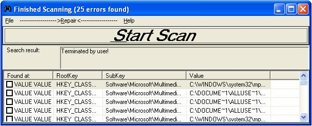



## Windows Registry Error Deleter 1\.0

### Description

This program is still being tested. I need as many people to test this out as possible and tell me how efficiently this scans for errors in the Windows registry. GIVE ME AS MANY COMMENTS AND IMPROVEMENTS AS YOU CAN! ALSO, GIVE ME A CATCHY NAME TO NAME THIS PROJECT! I DON'T SEEM TO BE GETTING MANY VIEWERS. Updated 6-30-05
 
### More Info
 

             |
---                |---
**Submitted On**   |2005-06-30 22:43:42
**By**             |[VB Beginner](https://github.com/Planet-Source-Code/PSCIndex/blob/master/ByAuthor/vb-beginner.md)
**Level**          |Beginner
**User Rating**    |4.9 (49 globes from 10 users)
**Compatibility**  |VB 6\.0
**Category**       |[Registry](https://github.com/Planet-Source-Code/PSCIndex/blob/master/ByCategory/registry__1-36.md)
**World**          |[Visual Basic](https://github.com/Planet-Source-Code/PSCIndex/blob/master/ByWorld/visual-basic.md)
**Archive File**   |[Windows\_Re190765712005\.zip](https://github.com/Planet-Source-Code/vb-beginner-windows-registry-error-deleter-1-0__1-61330/archive/master.zip)

